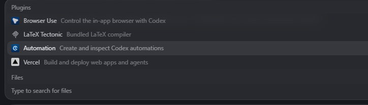

# Codex Automation Plugin Package

This package contains a local Codex plugin and documentation for creating, inspecting, updating, and deleting Codex desktop automations.

It is based on the working implementation we verified on Windows with Codex desktop. The most important lesson: when native automation tooling is not exposed, local fallback automation files must be written as UTF-8 without BOM or the Automations tab can silently ignore them.

## Package Contents

- `automation/`: the Codex plugin folder.
- `automation/.codex-plugin/plugin.json`: plugin manifest shown in the plugin store.
- `automation/skills/create-automation/SKILL.md`: the skill instructions agents should follow.
- `docs/images/codex-plugin-picker-preview.png`: preview image for the GitHub README.
- `AGENTS.md`: instructions for Codex-style agents using this package.
- `CLAUDE.md`: instructions for Claude-style agents using this package.
- `README.md`: human-facing setup and architecture documentation.

## Preview



## Install The Plugin In Codex

1. Put this package somewhere stable on disk.
2. Open Codex desktop.
3. Open the plugin store.
4. Select the local marketplace/folder entry for this package. With the included marketplace file, Codex should show it as `Automation Local`.
5. Find/select the `automation` plugin.
6. If Codex asks for a folder, choose this package root folder, not only the nested `automation` folder.
7. Click install.
8. In chat, call it with `@automation`.

This package includes `.agents/plugins/marketplace.json`, which is the local marketplace index Codex uses to discover the plugin the same way bundled marketplaces expose plugins such as `browser-use`.

The plugin store label comes from the marketplace file:

```json
{
  "name": "automation-local",
  "interface": {
    "displayName": "Automation Local"
  }
}
```

That means the plugin store can show the local package by marketplace/folder name. In the install flow we validated, the local marketplace appeared directly in the plugin store instead of behind an `Other` option.

After installation, `config.toml` should contain both a marketplace entry and an enabled plugin entry similar to:

```toml
[marketplaces.automation-local]
source_type = "local"
source = "C:\\Users\\you\\path\\to\\automations plugin"

[plugins."automation@automation-local"]
enabled = true
```

If only `[plugins."automation@automation-local"]` exists and there is no `[marketplaces.automation-local]`, Codex may have a cached plugin install but no stable marketplace source for every thread to index.

After installation, the plugin should appear as:

```text
@automation
```

The plugin is an instruction package. It teaches Codex how to create and manage automations. It is not itself the scheduler.

## Mention Visibility

The `@` mention picker is driven by the installed plugin marketplace state, not just by files in the current repo or by previous messages in a thread.

For reliable cross-thread visibility:

- Keep `.agents/plugins/marketplace.json` in the package root.
- Install from the package root folder so Codex registers the local marketplace.
- Confirm `C:\Users\<you>\.codex\config.toml` has both `[marketplaces.automation-local]` and `[plugins."automation@automation-local"]`.
- Restart Codex desktop or open a new thread after reinstalling so the composer mention cache is rebuilt.

If a thread can use the plugin but `@automation` does not appear in the picker, the native capability may still be loaded for that session while the composer autocomplete cache is stale.

If the plugin was installed before this marketplace file existed, uninstall it, reselect the local package root in the plugin store, then reinstall it from the marketplace/folder entry such as `Automation Local`.

## How The Plugin Works

Codex automations have two possible paths:

1. Native path: use Codex's internal/native automation API when available.
2. Local fallback path: write the local automation TOML file and update the scheduler SQLite mirror.

The native path is preferred because it automatically handles:

- schema validation
- writing the automation TOML
- updating scheduler state
- refreshing the Automations tab
- avoiding Windows encoding problems

If the native tool is not exposed in the current session, the skill falls back to local storage.

## Native Automation Tool

When available, the native tool is usually called:

```text
automation_update
```

Agents should search for this tool first before editing files manually.

Native tool arguments typically use camelCase:

```text
executionEnvironment
reasoningEffort
targetThreadId
localEnvironmentConfigPath
```

Raw TOML uses snake_case:

```text
execution_environment
reasoning_effort
target_thread_id
local_environment_config_path
```

Do not mix these shapes.

## Local Automation Storage

Current Codex desktop local automation storage uses:

```text
%USERPROFILE%\.codex\automations\<automation-id>\automation.toml
%USERPROFILE%\.codex\sqlite\codex-dev.db
```

The TOML file is the main source of truth once automation TOML files exist.

The SQLite database row is a scheduler-state mirror used for:

- `next_run_at`
- `last_run_at`
- current schedule state

The DB row alone is not enough to make an automation visible in the Automations tab.

## Visibility Rules

For an automation to appear in the Automations tab:

- The directory must be `%USERPROFILE%\.codex\automations\<id>`.
- The file must be named `automation.toml`.
- The TOML field `id` must exactly match the directory name.
- The file must parse successfully.
- The schema must validate.
- `status` must not be `DELETED`.
- The file must be UTF-8 without BOM.

The parser can silently ignore invalid files. If something does not appear, check encoding and schema first.

## Windows Encoding Rule

On Windows, do not use old Windows PowerShell `Set-Content -Encoding utf8` for automation TOML unless you verify the bytes afterward. Some PowerShell versions write a UTF-8 BOM.

Bad first bytes:

```text
ef bb bf
```

Good first bytes when the file starts with `version = 1`:

```text
76 65 72 73 69 6f 6e 20
```

Safe Python write pattern:

```python
from pathlib import Path

path = Path(r"C:\Users\you\.codex\automations\example\automation.toml")
text = "version = 1\n..."
path.parent.mkdir(parents=True, exist_ok=True)
path.write_text(text, encoding="utf-8", newline="\n")
assert not path.read_text(encoding="utf-8").startswith("\ufeff")
```

Safe verification:

```python
from pathlib import Path

path = Path(r"C:\Users\you\.codex\automations\example\automation.toml")
print(path.read_bytes()[:8].hex(" "))
print(path.read_text(encoding="utf-8").startswith("\ufeff"))
```

## Cron TOML Example

```toml
version = 1
id = "channel-analytics-10pm"
kind = "cron"
name = "Channel analytics 10 PM"
prompt = "Pull the latest public YouTube channel analytics, save the snapshot files, compare against the prior snapshot, and summarize what changed."
status = "ACTIVE"
rrule = "RRULE:FREQ=WEEKLY;BYHOUR=22;BYMINUTE=0;BYDAY=SU,MO,TU,WE,TH,FR,SA"
model = "gpt-5.5"
reasoning_effort = "medium"
execution_environment = "local"
cwds = ["C:\\Users\\you\\project"]
created_at = 1777351327467
updated_at = 1777351327467
```

Daily schedules are represented as weekly RRULEs with all seven days.

## Refresh Behavior

The Automations tab does not just watch the filesystem.

Known refresh triggers:

- The tab calls `list-automations`.
- Native create/update/delete invalidates the `list-automations` query.
- Automation run events dispatch `automation-runs-updated`.
- Navigating away/back can trigger a refetch.
- Restarting Codex can trigger a refetch.

In our working test, removing the BOM caused the automation to appear without restart once the tab refetched.

## Recommended Agent Flow

1. Read the installed skill: `automation/skills/create-automation/SKILL.md`.
2. Search for `automation_update`.
3. If available, use it.
4. If unavailable, inspect existing files and DB rows.
5. Write TOML as UTF-8 without BOM.
6. Mirror the scheduler DB row if this Codex version uses it.
7. Verify no BOM, matching `id`, valid fields, and DB row.
8. Tell the user exactly what was created and how to confirm it.

## Troubleshooting

If the automation does not appear:

1. Check the TOML first bytes for a BOM.
2. Check directory name equals TOML `id`.
3. Check required fields exist.
4. Check `kind` is either `cron` or `heartbeat`.
5. Check `cwds` exists for cron automations.
6. Check `target_thread_id` exists for heartbeat automations.
7. Check the running app is using the expected `%USERPROFILE%\.codex`.
8. Check the SQLite DB row only after the TOML is valid.
9. Trigger a UI refetch by navigating away/back or restarting.
